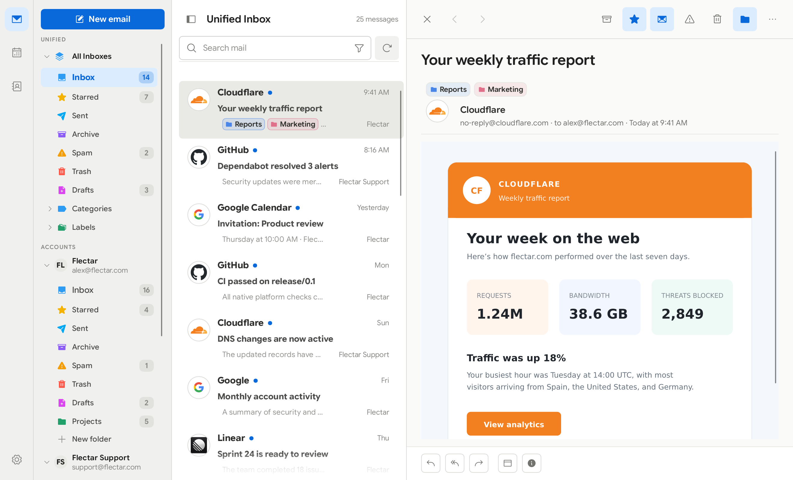
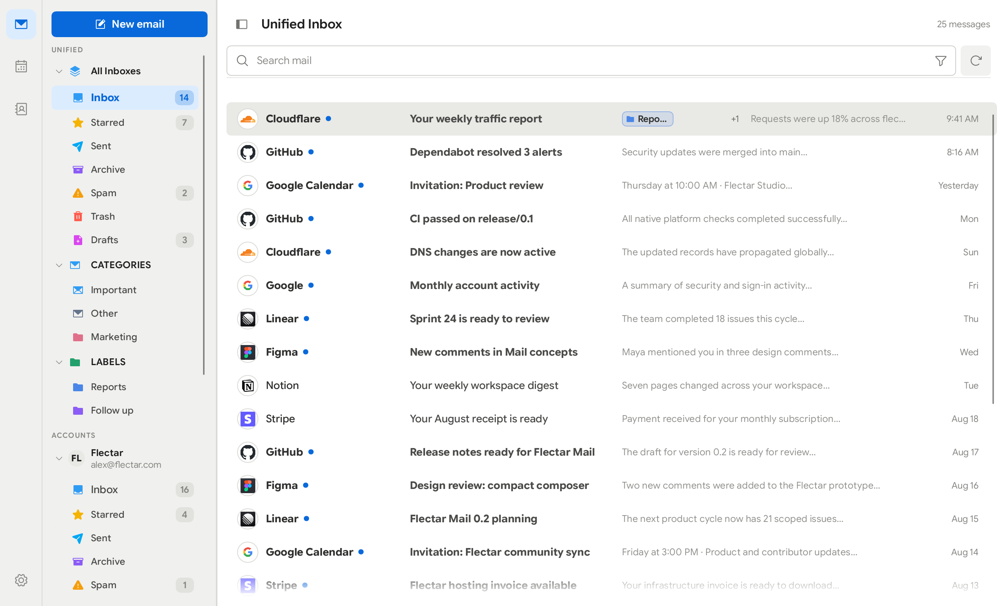
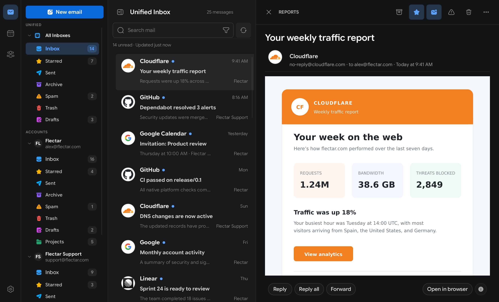
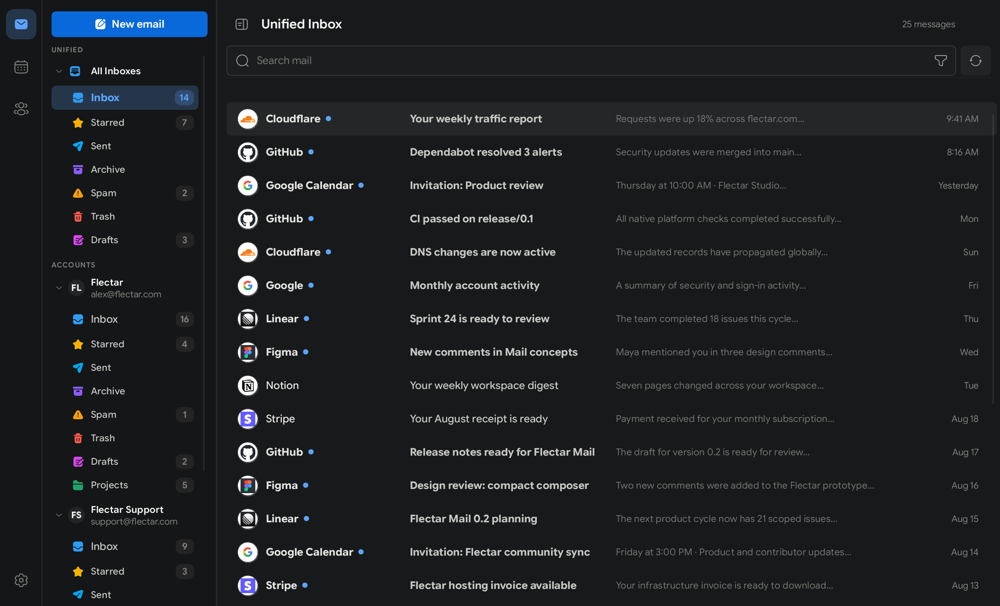
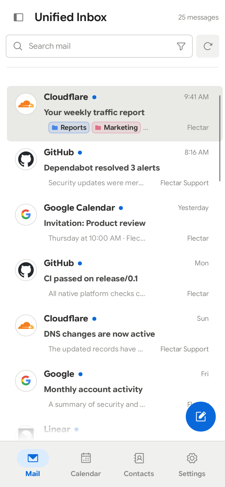
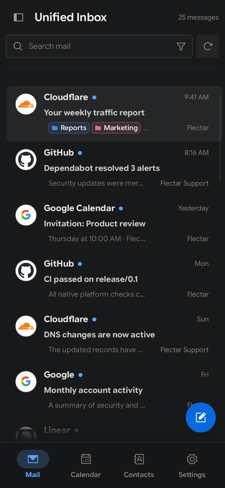

<div align="center">
  
  <h1 align="center">
    Flectar Mail
  </h1>
  <div align="center">
    <h3>Email, made fast again</h3>
    <p>Built from the ground up for speed. Flectar Mail delivers native performance, instant startup, and as little as 20 MB of RAM.</p>
  </div>
  <p>
    <a href="https://flectar.com">Website</a> ·
    <a href="https://github.com/flectar/mail/issues">Report an issue</a> ·
    <a href="CONTRIBUTING.md">Contribute</a>
  </p>
</div>

<picture>
  <source media="(prefers-color-scheme: dark)" srcset="resources/screenshots/desktop-dark.png">
  <source media="(prefers-color-scheme: light)" srcset="resources/screenshots/desktop-light.png">
  
</picture>

Flectar Mail is a lightweight, native home for your email, calendars, and
contacts. It is engineered to open instantly, stay responsive, and use a
fraction of the memory of a typical web-based mail client.

## Why Flectar Mail?

- **Fast from the first click.** A native interface and local-first data path
  get you to your inbox without waiting on a browser runtime.
- **As little as 20 MB of RAM.** Flectar Mail is deliberately designed to keep
  memory use low, even with a full-featured inbox at your fingertips.
- **Everything in one place.** Move between mail, calendars, and contacts
  without stitching together separate apps.
- **Offline by design.** Your mailbox and calendar are stored locally, so your
  synced data remains useful without a connection.
- **Works with your accounts.** Connect Gmail, Outlook and Microsoft 365, or
  standards-based IMAP/SMTP, JMAP, and CalDAV services.
- **Privacy-conscious defaults.** Remote images are blocked until you allow
  them, helping prevent tracking pixels from reporting when you read a message.
- **Security by architecture.** Email content is never opened in a WebView.
  Flectar Mail renders HTML and CSS through its own Rust-native pipeline, does
  not execute email scripts, and blocks remote images by default. This avoids
  the embedded-browser attack surface by design.
- **An experimental Rust renderer.** Building an email renderer without a
  browser engine is new territory. Rendering issues are expected, especially
  in complex messages, while compatibility continues to improve.
- **Made for every screen.** Spacious and minimal desktop layouts share the
  same experience as the touch-friendly compact interface.
- **Native and open source.** Built from the ground up with Rust. It is not a
  browser wrapped in a window, and it is released under the AGPLv3.

## Make it yours

Choose the workspace that fits the way you handle email. Keep the detailed
three-pane layout, switch to a streamlined minimal view, choose a light or dark
theme, and show or hide sender avatars.

The full workspace keeps your folders, message list, and selected email visible
together. The minimal layout reduces visual noise and gives each part of your
inbox more room when you need it.

### Light

| Full workspace | Minimal workspace |
| --- | --- |
|  |  |

### Dark

| Full workspace | Minimal workspace |
| --- | --- |
|  |  |

### Made for smaller screens

The compact interface keeps the important actions within reach while giving
messages, events, and contacts the full screen when they need it.

| Light | Dark |
| --- | --- |
|  |  |

## Get Flectar Mail

Flectar Mail is currently in public preview and is not yet stable. Download the
latest build from [GitHub Releases](https://github.com/flectar/mail/releases/latest):

- **Linux x64:** AppImage or Debian/Ubuntu `.deb` package
- **Windows x64:** Portable ZIP
- **macOS Apple silicon:** Application ZIP
- **Android:** Work in progress and coming soon

You can also build Flectar Mail from source with the
[Rust toolchain](https://rustup.rs/):

```bash
cargo run --bin flectar-mail
```

## Open source, for everyone

Flectar Mail is one open-source application. There is no separate community
edition. The client is licensed under the
[GNU Affero General Public License v3](LICENSE). Read the
[licensing overview](LICENSING.md) for the practical details, or see
[CONTRIBUTING.md](CONTRIBUTING.md) to help shape the project.

---
